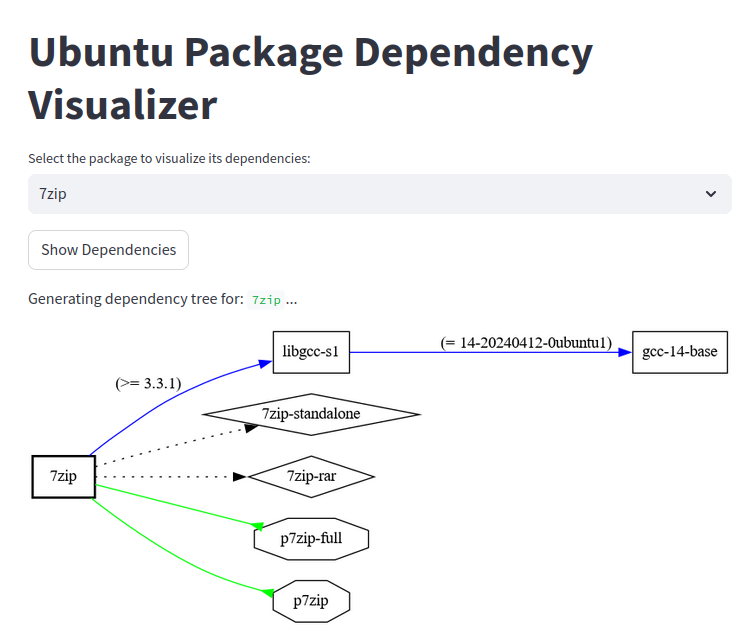

# Ubuntu Package Dependency Visualizer
A simple streamlit app to display host installed deb packages dependencies using dpkg, debtree and dot.



## Prerequisites

Make sure the following are installed on your Ubuntu server:

- Python 3.x
- `debtree` and `graphviz`:

  ```bash
  sudo apt-get install debtree graphviz
  ```
## Setup

Clone the repository:
```bash
git clone https://github.com/yourusername/ubuntu-package-dependency-visualizer.git
cd ubuntu-package-dependency-visualizer
```
Install streamlit dependency:
```bash
pip install streamlit
```

## Running the App

Run the app with Streamlit:

```bash
streamlit run app.py
```
The app will launch in your browser, where you can dynamically select an installed package to visualize its dependency tree.
